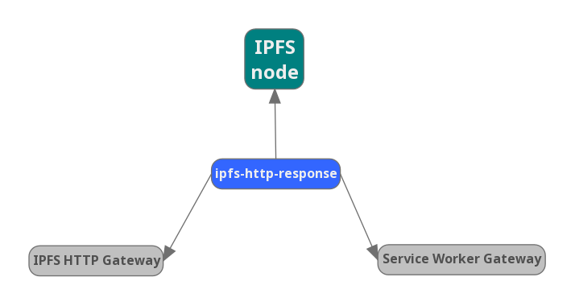

# js-ipfs-http-response

[](http://protocol.ai)
[](http://ipfs.io/)
[](http://webchat.freenode.net/?channels=%23ipfs)
[](https://github.com/RichardLitt/standard-readme)
[](https://github.com/feross/standard)

> Creates an HTTP response from an IPFS Hash

## Lead Maintainer

[Vasco Santos](https://github.com/vasco-santos).

### Installation

> npm install ipfs-http-response

## Usage

This project consists on creating a HTTP response from an IPFS Hash. This response can be a file, a directory list view or the entry point of a web page.

```js
const ipfsHttpResponse = require('ipfs-http-response')

ipfsHttpResponse(ipfsNode, ipfsPath)
  .then((response) => {
    ...
  })
```


